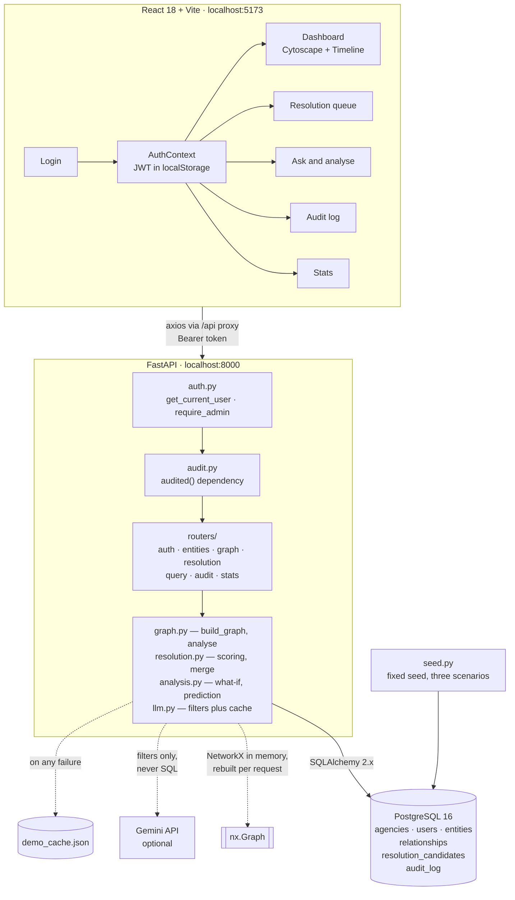

# CrimeNet AI

**AI-powered criminal network analysis — multi-source graph, human-confirmed entity
resolution, agency-scoped access, and a tamper-evident audit log.**

---

## The problem

Crime data lives in silos. A police FIR names a suspect. A telecom record shows one
number calling another. A vehicle registry holds an owner and a plate. Each is
queried separately, so the connection that matters — *this phone belongs to the
brother of a man named in an unrelated case, who co-owns the vehicle seen at a
third* — only surfaces if an investigator happens to notice it by hand.

That does not scale. Past two hops, those connections are effectively invisible,
and in organised crime the indirect ones are the important ones.

## What this does

Pulls records from three mock agency sources into one graph, proposes which records
refer to the same real person (**a human always confirms — nothing auto-merges**),
and gives an investigator a visual, time-aware, agency-scoped view of that network.
Every access is written to a SHA-256 hash-chained audit log, so tampering with any
row is detectable and the exact row is reported.

Five things it sets out to prove:

1. Multi-source data appears as one interactive graph
2. The same query returns a different graph depending on who is logged in
3. Duplicate identities are proposed with a confidence and an explanation, and a
   human confirms the merge
4. Tampering with any audit row is detected, and the exact row is named
5. A timeline replays how the network grew; removing a key node splits it

## Stack

FastAPI · PostgreSQL 16 · SQLAlchemy 2.x · NetworkX · PyJWT · React 18 + Vite ·
Cytoscape.js · Tailwind v4 · hosted LLM API (optional — see below)

---

## Setup

Needs **Python 3.11+**, **Node 18+** and **Docker**. About five minutes from a
clean clone.

### 1. Postgres

```bash
docker run --name crimenet-db -e POSTGRES_PASSWORD=crimenet \
  -e POSTGRES_DB=crimenet -p 5433:5432 -d postgres:16
```

> **Why 5433 and not 5432.** Both of our machines already run a native Windows
> PostgreSQL service on 5432. Docker will *appear* to publish onto a taken port and
> the app then reaches the wrong server — which surfaces as an authentication
> failure and sends you looking in the wrong place. If 5432 is genuinely free on
> your machine, use `-p 5432:5432` and change the port in `.env` to match. If
> unsure, keep 5433.

Confirm which server you actually reached:

```bash
docker exec crimenet-db psql -U postgres -d crimenet -c "SELECT version();"
```

It must say **PostgreSQL 16**. Anything else means you are talking to a different
server.

### 2. Configuration

```bash
cp .env.example .env
```

Generate a real `JWT_SECRET` — the placeholder is short enough that PyJWT warns on
every token:

```bash
python -c "import secrets; print(secrets.token_urlsafe(48))"
```

`LLM_API_KEY` can stay empty. The natural-language features fall back to a
committed response cache and work fully offline — see *Running without an API key*.

### 3. Backend

```bash
cd backend
python -m venv .venv
.venv/Scripts/python.exe -m pip install -r requirements.txt     # Windows
# source .venv/bin/activate && pip install -r requirements.txt  # macOS / Linux
```

Create the tables and load the demo data:

```bash
python seed.py --reset --verify
```

That drops and recreates all six tables and seeds ~650 entities and ~940
relationships in under two seconds. `--verify` then asserts the three demo
scenarios are present and prints a content digest. **Both machines must print the
same digest** — the seed is deterministic, so a mismatch means something diverged:

```
549e06df2ed10651dbb132bb3eb566d9f8c0d2b45c48215d6b4f9f203c9289e1
```

Start the API:

```bash
uvicorn app.main:app --reload
```

`http://localhost:8000/api/health` should return
`{"status":"ok","db":"connected"}`, and `/docs` lists every endpoint.

### 4. Frontend

```bash
cd frontend
npm install
npm run dev
```

Open `http://localhost:5173`.

### 5. Log in

Six seeded accounts. **The password is always the username followed by `123`** —
these are synthetic, local-only accounts and the demo needs known logins.

| Username | Role | Agency | Sees |
|---|---|---|---|
| `investigator` | investigator | GJ_POLICE | 402 of 650 entities |
| `admin` | admin | GJ_POLICE | everything |
| `telecom_officer` | investigator | TELECOM | 217 of 650 |
| `telecom_admin` | admin | TELECOM | everything |
| `rto_officer` | investigator | RTO | 191 of 650 |
| `rto_admin` | admin | RTO | everything |

Logging in as `investigator` and then `admin` against the same centre node is the
scoping demo — the graph is visibly larger for the admin.

### Tests

```bash
cd backend  && python -m pytest tests/ -q
cd frontend && npm run lint && npm run build
```

### Running without an API key

Everything except the live LLM call works with no internet. With `LLM_API_KEY`
empty, `POST /api/query/nl` answers from `app/demo_cache.json`, which holds the
four scripted demo questions. The cache supplies **phrasing only** — counts and
entity ids are always recomputed from the live database, so nothing on screen is a
number from a recording. Case briefs are composed locally from the real graph.

---

## Architecture



Three things worth noticing in that picture.

**Every graph route passes through `audited()`.** It is a FastAPI dependency rather
than a call inside the handler, so a route physically cannot read graph data
without appending an audit row first.

**The graph is rebuilt in memory per request.** NetworkX is never persisted. At the
PRD's 1,500-entity ceiling that is two queries, and it removes every
cache-invalidation question a stored graph would introduce. No Neo4j.

**The LLM sits outside the data path.** It receives a schema description and returns
filters; those filters are validated against a fixed allow-list, and *our* code
runs the query. A model that returned SQL would simply fail validation.

### Scoping, which is the core of the demo

| | Entities | Relationships |
|---|---|---|
| **admin** | all | all |
| **investigator** | own agency **or** `is_shared` | own agency only |

Relationships scope on agency alone, and that is deliberate rather than an
omission: the edge is the sensitive part. That a phone exists may be shareable;
who called whom is a telecom record a police investigator has no claim on. There is
a consequence visible on screen — a shared node can appear with no edges.

---

## Data and ethics

**No real personal data, at any point.** All data is synthetic, generated by
`seed.py` with a fixed random seed. India's DPDP Act is the governing legal
context; this project stays outside its scope by using fake data throughout.

This system does **not** predict crimes or individual criminality. What it does is
network-impact simulation and link prediction over records that already exist. That
distinction is deliberate — see `PRD.md` Section 4.

**Known trade-off:** the JWT lives in `localStorage`, which is XSS-vulnerable. It is
an accepted MVP decision, stated here rather than hidden; production would use an
httpOnly refresh cookie.

## Documentation

| File | Contents |
|---|---|
| `CLAUDE.md` | Project guide — constraints, stack, data model, API surface, conventions, file ownership |
| `PRD.md` | Feature requirements, acceptance criteria, seven-week stage plan |
| `TEAM-WORKFLOW.md` | How two people share one repo without overwriting each other |
| `PROGRESS.md` | Current status, shared-file log, open requests |
| `KICKOFF.md` | Onboarding for a new session |

## Team

Apostrophe — Rishabh Nandekar, Krish Ketankumar Shah.
Reference brief: Smart India Hackathon 2026, Problem Statement 26189.

---

### Repository metadata

**Description:** AI-powered criminal network analysis — multi-source graph, entity
resolution, agency-scoped access control, and a tamper-evident hash-chained audit
log. SIH 2026 PS 26189.

**Topics:** `criminal-network-analysis` `graph-analysis` `networkx` `fastapi`
`react` `postgresql` `cytoscape` `entity-resolution` `audit-log` `sih-2026`
